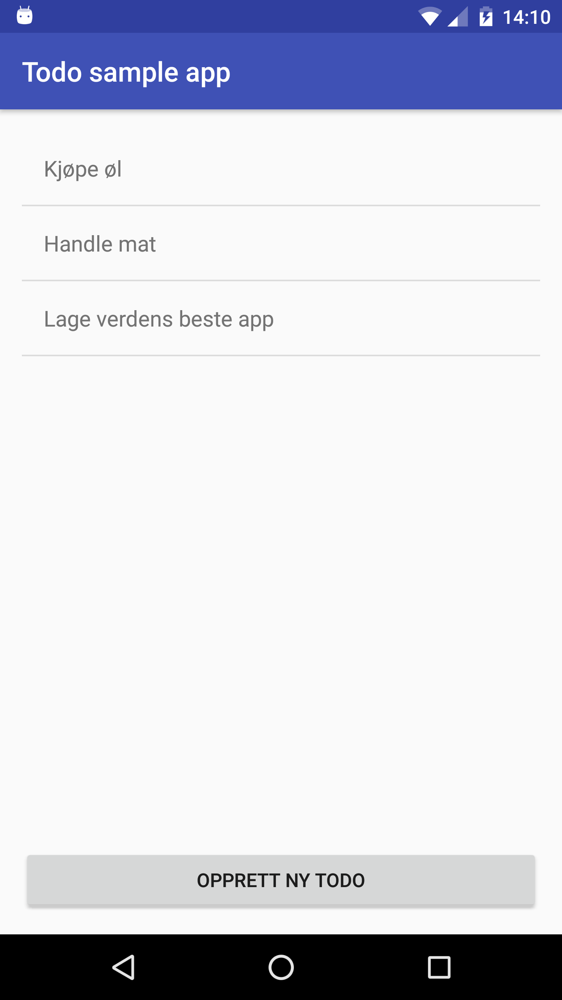
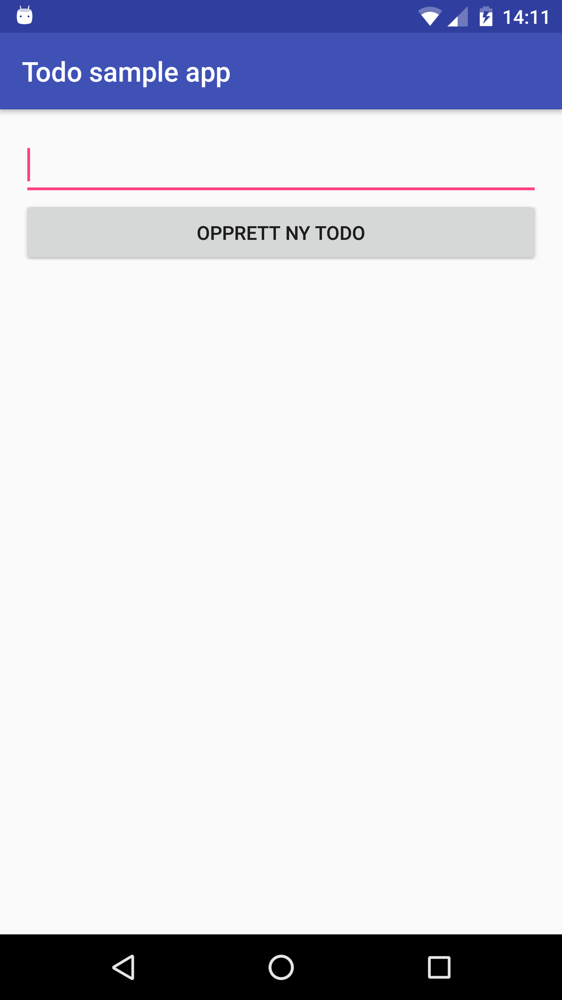

# Todo app
Todo App brukt som illustrasjon på App workshop ved Universitetet i Bergen.

## Ressurser
- [Crowdsourced Guide to Android](http://guides.codepath.com/android)
- [Android Developers: Getting Started](https://developer.android.com/training/index.html)
- [Context, What Context?](https://possiblemobile.com/2013/06/context/)
- [Android Niceties](http://androidniceties.tumblr.com/)
- [Fragments](https://developer.android.com/guide/components/fragments.html)
- [Reddit /r/androiddev](https://www.reddit.com/r/androiddev/)
